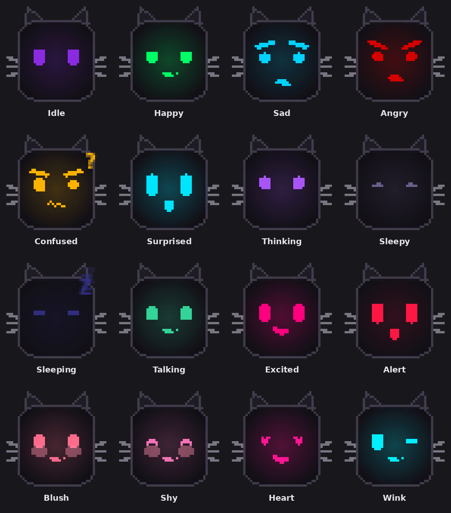

# 🐱 Mochi

Mochi is a small, local-first desktop companion: a black rounded "screen"
with cat ears and whiskers that sits on your desktop and shows an
expressive pixel face — no body, no walking, just a face that
reacts to you. You can type to it, and it can create local reminders,
tasks, and timers, answer open-ended questions through an optional local
LLM, and remembers roughly how often you've talked to it.

Nothing leaves your machine unless you explicitly turn on an integration
that needs the network. Chat's optional LLM step talks to a
locally-running Ollama, not the cloud; the one exception is the fully
opt-in Google Calendar connection (see below), which is off by default.

---

## What Mochi looks like

A ~180×180px frameless, translucent window: a dark rounded square with
small triangular ears and a few whiskers, and a glowing pixel face on top.
"Pixel" describes the deliberately blocky, geometric shape language
(rounded-rect eyes, hard-edged mouths - the same visual grammar as an LED
matrix icon), not literal jagged rasterization: the face is drawn fully
antialiased at the widget's real resolution, so curves and edges stay
smooth. There's one unified casing look (no user-selectable palette) —
instead, the **glow color itself changes per expression**, like
an LED status light: idle is calm violet, happy is emerald green, angry is
deep crimson, and so on, easing into its new hue over a fraction of a
second rather than cutting instantly. It blinks on its own, has a faint
idle "breathing" glow, and its pupils drift toward your mouse cursor while
idle. Every expression change eases and bounces into place through a small
spring-physics layer rather than snapping instantly, and each reaction
holds long enough to actually register (tuned per-emotion in
`REACTION_HOLD_MS` - a surprised flash is quick, alert runs its full
multi-second pulse sequence, a sulk lingers) — that's the main thing that
makes it read as alive rather than a slideshow of static faces.

**Expressions (16):** idle, happy, sad, angry, confused, surprised,
thinking, sleepy, sleeping, talking, excited, alert, blush, shy, heart,
wink — all drawn programmatically (no image assets), so every expression
is just numbers (eye openness, pupil offset, mouth shape, brow angle,
color) plus a handful of dedicated shapes for a few states: angry
furrows both brows into a sharp downward frown (steeper and thicker than
a mild sad brow, not just a slight squint), confused shows a small
floating "?", shy closes its eyes into a soft upward curve, sad gets a
small falling tear, excited sparkles a tiny star beside each eye, and
alert runs a six-phase detect → flash-on → peak → flash-off → flash-on →
return pulse (with a tiny vibration at its peak) instead of a static
glow. Chat reactions pick between these organically — a mild compliment
gets a shy blush, "I love you" gets heart-eyes, and an ignored-too-long
attention ping alternates between an alert pulse and a playful wink.



**LED color map** — one canonical color per expression, tuned by
arousal/valence rather than picked arbitrarily (see
`app/character/theme.py`):

| Expression | Hex | Meaning |
|---|---|---|
| Happy | `#22C55E` | joy, warmth, optimism |
| Excited | `#F97316` | energy, enthusiasm |
| Wink | `#FFEA00` | playful, cheerful mischief |
| Idle | `#C8C8D2` | neutral, resting |
| Sad | `#3B82F6` | melancholy, tears |
| Sleepy | `#C4B5FD` | twilight comfort, drowsiness |
| Sleeping | `#312E81` | deep night, stillness |
| Angry | `#E53935` | fury, danger |
| Alert | `#FFC107` | warning light, heightened awareness |
| Heart | `#EC4899` | affection, love |
| Blush | `#F8A6C0` | embarrassment |
| Shy | `#FFAB91` | modest, self-conscious |
| Confused | `#14B8A6` | disorientation, mental fog |
| Thinking | `#1E3A8A` | logic, structured analysis |
| Surprised | `#C6FF00` | sudden shock, unpredictable |
| Talking | `#22D3EE` | steady communication, flow |

**Sleep:** eyes close and a small cartoon-style "Zzz" floats up and fades
near the ear, looping, always contained within the window's own bounds.

**Personality:** a playful kitten that wants attention. Left alone, it
doesn't sit static — it occasionally perks up (alert or wink), gets
sleepy, and falls asleep; any interaction wakes it back up. It shows
"thinking" the instant you send a chat message, gets happy when you
complete a reminder or task, and gets annoyed if a reminder sits ignored
for a while.

**Lock-screen easter egg (Windows only):** when you lock your PC, Mochi
closes its eyes; every couple of seconds it playfully peeks one eye open,
then closes it again; unlocking wakes it up excited. Purely cosmetic, no
password handling of any kind on Mochi's side — it just detects the OS
lock state (see `app/character/lock_watcher.py`). No-ops safely on
non-Windows platforms.

**Shake-it easter egg:** grab Mochi and shake it (rapid back-and-forth
drag) and its eyes spin dizzily for a moment — then it gets properly
annoyed with you (angry face + a scolding speech bubble) before settling
back down. Detected purely from cursor movement while dragging (see
`app/character/shake_detector.py`), no accelerometer/OS hooks involved.

**Expression timing:** every reaction — chat replies, task/reminder
completions, unlock, shake — holds for a duration tuned to that specific
emotion (a surprised flash is quick; a sulk lingers) before settling back
to idle, instead of being interrupted by the next autonomous-behavior
tick a couple of seconds later. The floating speech bubble and the face
expression are timed together so they appear and clear as one reaction.

---

## Chat

Double-click Mochi (or right-click → Chat) to open a small translucent
chat popup — messages render as rounded speech bubbles (yours on the
right, Mochi's on the left), like the floating bubble above the
character itself. It stays pinned on top of other windows while open
(toggle via the green dot) so it doesn't get buried mid-conversation, and
only goes away when you actually close it. Messages are handled in two
layers:

1. **Deterministic, local, no AI required** — reminders, tasks, timers,
   greetings, and common small talk are recognized by a rule-based
   matcher and handled directly. This is intentional: things that create
   or delete data should never depend on a language model's judgement.
2. **Local LLM fallback** — anything that bucket doesn't recognize is
   sent to a locally-running [Ollama](https://ollama.com) model (default
   `qwen3:0.6b`, configurable) for a real conversational reply, on a
   background thread so a slow reply never freezes the chat window. The
   prompt always includes the actual current local date/time, so
   "what time is it"/"is it late"/relative phrasing like "remind me
   tonight" have real ground truth to answer from instead of the model
   guessing. If Ollama isn't installed, isn't running, or the model
   hasn't been pulled, Mochi says so directly ("my brain's offline right
   now...") rather than giving the same generic "I'm not sure what you
   mean" line a genuinely-unrecognized message gets — the LLM is a
   nice-to-have layered on top of a fully working local app, not a
   requirement, but it shouldn't be a mystery when it's not active.

Mochi also keeps a lightweight local interaction counter (not any kind of
learned model) that shifts its greeting and tone a little as you talk to
it more — new, getting-to-know, and familiar.

While a reply is pending, both the chat window ("thinking...") and the
character itself show it — Mochi's face actually holds a THINKING
expression for the whole wait, up to the ~30s an LLM call can take,
rather than the autonomous idle/happy cycling elsewhere on the desktop
stomping it a couple seconds in (see `BehaviorEngine.enter_busy()` /
`exit_busy()` in `app/character/behavior.py`).

The LLM fallback's system prompt explicitly forbids it from claiming to
have created, checked, completed, or cancelled a reminder/task/timer —
it has no access to do any of that, and the deterministic layer above
handles anything phrased as an actual command before the LLM is ever
asked. This matters because a small local model asked "did you check on
X?" will happily improvise a confident-sounding "yes, I'll remind you..."
if not told otherwise, which is a lie the person has no way to catch
until it quietly never happens.

Also handled deterministically, no AI required: ask Mochi to
`count to 10` (or `count from 3 to 7`) and it actually counts it out with
excitement, capped at 30 numbers so a typo can't turn it into a wall of
text.

---

## Reminders, tasks & timers

All three are fully local, stored in SQLite, and handled entirely through
chat — creating them ("remind me to call mom at 7pm", "set a reminder to
water plants at 8am", "set a timer for 10 minutes", "5 minute timer",
"add task buy milk", "new task clean my room", "remember that I need to
buy milk"), checking them ("do I have any tasks?", "what reminders do I
have?", both answered from the real database, never guessed by the LLM),
and acting on ones that already exist ("mark my task to call aunt as
done", "cancel my reminder to call mom", "cancel the timer") — matched
against whatever's actually open/active by title, so it resolves "call
aunt" against a task literally titled "Call aunt" without needing an
exact-string match. If nothing (or more than one thing) matches, Mochi
asks which one you mean rather than guessing. There's deliberately no
separate right-click menu for any of this — one consistent way in via
chat, rather than a manual window/form duplicating what chat already
does end to end. Chat recognizes a fairly wide range of everyday
phrasing (see `TASK_TRIGGER`/`REMINDER_TRIGGER`/`TIMER_TRIGGER` in
`app/ai/intent.py`); every message's detected intent is also logged
(`mochi.ai.chat_engine`), so if a phrasing genuinely doesn't match yet
it's visible in the log rather than silently doing nothing.

Two more phrasings that don't need the literal word "task"/"reminder":
"check on <something>" reports the real status of whatever matches it in
either store ("Yep - 'message my aunt' is set for 19:00", or "I don't
have anything like that saved" if nothing matches) — it never invents an
answer. And "mark it as done" / "that's done" / "I finished it" resolves
"it" against whatever's currently open across both tasks and reminders,
auto-completing it if there's exactly one, or asking which one if there's
more than one. Both exist specifically because falling through to the
local LLM for phrasing like this used to produce a hallucinated reply —
"I'll remind you..." or "Okay, I'll take care of it" — that sounded
plausible but hadn't actually checked or changed anything.

- **Reminders** — one-off or repeating (`DAILY`/`WEEKLY`/`MONTHLY`), with
  a background scheduler that checks for due reminders and surfaces them
  with an animation, sound, speech bubble, and OS notification. If a
  reminder is still pending several minutes later, Mochi reacts annoyed.
- **Tasks** — a simple open/done checklist. A due date is optional — add
  a task with no deadline ("add task buy milk") and it just sits in the
  list until you mark it done; give it a deadline ("add task submit
  report at 5pm") and it sorts to the front of the list, soonest first,
  ahead of undated tasks. Unlike reminders, a task with a deadline
  doesn't get its own notification/scheduler — it's a checklist entry
  with a date attached,
  not a timed alert.
- **Timers** — short countdowns that persist across restarts.

---

## Chat memory & humor

Each chat window remembers the whole conversation for as long as it stays
open — every reply that falls through to the local LLM (see below) gets
the recent conversation as context, not just your latest message in
isolation. Closing the chat window clears that session; opening it again
starts fresh.

Once in a while, if Mochi's been idle long enough to get bored (see
below), it'll also crack a joke unprompted — by default this fetches a
fresh one from a small no-auth joke API, falling back to a built-in
offline list if that's unreachable or disabled
(`MOCHI_HUMOR_ENABLED=false` in `.env` for a fully offline Mochi).

Separately, and **off by default**, Mochi can also stay lightly aware of
what's actually trending — and what's actually funny — right now
(`MOCHI_TREND_AWARENESS_ENABLED=true` in `.env`). This pulls two things on
a slow background timer: general headlines
(`app/humor/trend_fetcher.py`) and, more importantly for "meme level"
humor, real current meme post premises from general-audience meme
subreddits (`app/humor/meme_fetcher.py`, no login/API key needed). Both
get reduced to a short paraphrased label/premise before caching — Mochi
never stores or repeats the actual headline or meme caption text, and
never fetches meme images — and its LLM chat replies may riff on a cached
one in its own voice if it naturally fits, with the meme premise
preferred over a generic headline when both are available. Talks to the
open internet (Google News' RSS feed + Reddit's public JSON endpoints),
which is why it's opt-in rather than on by default.

---

## Calendar

Say things like *"what's on my calendar today?"*, *"anything tomorrow?"*,
or *"what's coming up?"* and Mochi answers from your real Google
Calendar. This is the one integration that's off by default and reaches
an actual external service rather than your own machine, so it's
entirely opt-in:

1. `pip install -r requirements-calendar.txt`
2. In [Google Cloud Console](https://console.cloud.google.com/), create
   an OAuth client ID of type **Desktop app** and download its client
   secret JSON. Save it as `config/google_credentials.json`.
3. Set `MOCHI_GOOGLE_CALENDAR_ENABLED=true` in `.env`.
4. Say **"connect my calendar"** to Mochi. A browser window opens for a
   one-time Google consent screen; once approved, the resulting token is
   cached locally at `config/token.json` so this only happens once.
   **"disconnect my calendar"** deletes that local token again (it does
   *not* revoke the grant on your Google account — do that from
   [Google's own permissions page](https://myaccount.google.com/permissions)
   if you want to fully revoke it).

By default only the narrow `calendar.readonly` scope is requested —
Mochi cannot create, edit, or delete anything on your calendar. Set
`MOCHI_GOOGLE_CALENDAR_WRITE_ENABLED=true` to also let Mochi create and
cancel events (widens the scope to `calendar.events`, which still can't
touch calendars themselves, only events on your primary one). If you
already connected in read-only mode, turning this on means saying
"connect my calendar" again so the reconnect actually grants the wider
permission — Google enforces whatever scope was granted at consent time,
regardless of what's in `.env`.

With write access on, Mochi never creates or cancels anything
immediately — every request is proposed first and only acted on after
you explicitly confirm:

```
You:   schedule a meeting with Devika tomorrow at 5pm
Mochi: I found this:

       Meeting with Devika
       Tue Aug 25 at 17:00

       Add it to your Google Calendar? (yes/no)
You:   yes
Mochi: Done! Added "Meeting with Devika" to your calendar.
```

```
You:   cancel my 5 PM meeting
Mochi: I found: Standup at 17:00.

       Cancel this event? (yes/no)
You:   yes
Mochi: Done! Cancelled "Standup".
```

If it's disabled, not yet set up, or the sign-in has expired/lacks the
right permission, Mochi says so directly (e.g. *"say 'connect my
calendar' to reconnect with edit access"*) instead of guessing or
pretending.

---

## Running it

```bash
python -m venv .venv
source .venv/bin/activate        # Windows: .venv\Scripts\activate
pip install -r requirements.txt
cp .env.example .env
python -m app.main
```

Chat, reminders, tasks, and timers all work out of the box with no
further setup. For richer open-ended chat replies, install
[Ollama](https://ollama.com), run `ollama pull qwen3:0.6b` (or your
preferred model, set via `MOCHI_LLM_MODEL` in `.env`), and make sure
Ollama is running — Mochi will start using it automatically.

### Running tests

```bash
pip install -r requirements-dev.txt
pytest
```

Also install `requirements-calendar.txt` first if you want the Google
Calendar-specific tests exercised against the real optional client
libraries too (they pass either way - see `tests/test_google_calendar.py`).

### Linting

```bash
pip install -r requirements-dev.txt
ruff check .
```

There is no CI pipeline for this project - run `ruff check .` and the
test suite locally before opening a PR, ideally once with the optional
calendar dependencies installed and once without, so a normal
(fully-local) install and a calendar-enabled one both stay green.

---

## Project layout

See [`PROJECT_ARCHITECTURE.md`](./PROJECT_ARCHITECTURE.md) for the full
module map and data flow. Quick orientation:

```text
app/
├── main.py          application entry point / wiring
├── core/             config, logging, event bus, exceptions
├── character/        the pixel face, its behavior/personality, the window
├── ai/                intent detection, local-LLM fallback, chat orchestration
├── memory/            SQLite connection + schema, familiarity tracking
├── reminders/         local reminder engine (manager, scheduler, notifications)
├── tasks/             local to-do list
├── timers/            local countdown timers (manager, scheduler, notifications)
├── calendar/          Google Calendar integration (read-only, opt-in)
├── tools/             JSON-in/JSON-out functions chat's intent layer calls
└── ui/                chat/reminders/tasks/timers windows, tray icon

config/             OAuth client secret + token cache (gitignored, calendar only)
data/               local SQLite database (gitignored)
tests/              pytest suite
```

---

## Privacy

- No cloud AI, no conversation upload, no remote database.
- The only network-capable features are the optional local-LLM chat
  fallback (talks to Ollama on `localhost` — not a hosted API) and the
  optional, off-by-default Google Calendar integration (see above) —
  everything else works fully offline.
- Chat can never directly execute an action: the LLM/intent layer only
  proposes an action, and Python validates and runs it (see
  `PROJECT_ARCHITECTURE.md §5`); calendar reads/connects are handled the
  same deterministic way, never left to the LLM.
- No paid APIs, no subscriptions, no API keys required for normal use —
  Google Calendar needs a one-time free OAuth client ID, not a key or a
  subscription.

---

## License

Custom attribution-required license — see [`LICENSE`](./LICENSE).
Copyright stays with Vedanshi Mesvaniya as the original author; others
may use, modify, and distribute the project provided they credit the
original author and don't claim it or a derivative as their own
original work. Third-party dependencies (PySide6/Qt, Ollama-served
models, Google API client libraries) carry their own licenses — check
before distributing a packaged build.
